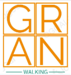

# Usability Report

#### Evaluación de usabilidad del proyecto 

### (Gran Walking)

### (29/05/2024)

[Enlace a GITHUB del proyecto](https://github.com/Machaquilla/DIU)

### Realizado por:

[Informe realizado por Equipo AveFenix ]

## 1 DESCRIPCIÓN DEL WEBSITE

 El proposito principal es una web para conocer gente y ofrecer distintas actividades en distintos lugares para andar. Te puedes registrar, apuntar, etc a estas actividades.

## 2 RESUMEN EJECUTIVO

Evaluación detallada de la usabilidad del sitio web "Gran Walking"

Dificultad para encontrar ciertas funcionalidades.
Confusión en la navegación.
Problemas de diseño ya que la web esta a veces vacia.

## 3 METODOLOGIA 

#### Metodología de usabililidad

La evaluación se ha hecho utilizando varias técnicas, incluyendo pruebas de usuarios y análisis de eyetracking. 
Hemos hecho pruebas con usuarios en el que prueban la web y nos cuentan sus opiniones.
- Sesiones de prueba de usuario: Los participantes interactuaron con la web para completar tareas específicas.
- Cuestionarios SUS (System Usability Scale): Se recogieron respuestas de usuarios para obtener un puntaje de usabilidad.
- Eyetracking: Se utilizó para analizar el patrón de mirada y las áreas de interés.

 

#### Test de usuarios: Participantes
Para el caso SUS se han seleccionado dos de estas personas y se les han mostrado ambas interfaces

| Usuario ID| Sexo      | Edad | Ocupación  | Experiencia TIC         | Perfil  | Test | SUS  |
| --------- | --------- | ---- | ---------- | ----------------------- | ------- | ---- | ---- | 
| Julia | Femenino  | 24   | Profesora        | Media | Le apasiona la enseñanza y siempre está buscando maneras innovadoras de enseñar tambien le gusta el deporte.                               | A    | 95   |
| Paco  | Masculino | 22   | Estudiante       | Alta  | Está cursando una carrera en informática y le encanta estar al día con las últimas innovaciones tecnológicas y deporte en su tiempo libre. | A    | 85   |
| Juan  | Masculino | 25   | Obrero           | Media | Aunque su trabajo no está directamente relacionado con la tecnología ni el deporte esta iniciandose en ello.                               | A    | 80   |
| Mar   | Femenino  | 30   | Administradora   | Media | se encarga de la gestión de diversas tareas administrativas y en su tiempo libre practicar deporte.                                        | B    | 82.5 |

#### Resultados obtenidos

Los resultados de los cuestionarios SUS muestran una puntuación positiva en la usabilidad del sitio web, aunque hay margen para mejorar. Los resultados del eyetracking también son buenos, pero indican áreas que pueden mejorar, como el proceso de login.

## 4 CONCLUSIONES 

Aunque la idea y las funciones ofrecidas han sido bien recibidas, se han identificado varias áreas que requieren mejoras.

#### Incidencias
No esta disponible en ningun lado el .fig en github ni esta en el grupo comun de figma, para comprobarlo con las animaciones. O la app en si.

- Algunas funciones no fueron intuitivas, causando que los usuarios necesitaran más tiempo o ayuda para navegar.
- La navegación resultó confusa en algunos casos.
- Algunas páginas del sitio web parecen vacías, lo que puede desorientar a los usuarios.

#### Valoración 

- Los usuarios valoraron positivamente la idea de la web y las funciones ofrecidas, especialmente la posibilidad de conocer gente y participar en actividades.
- La integración de múltiples servicios en una sola plataforma fue bien recibida.
- La consistencia en el diseño también fue apreciada.

#### Recomendaciones y propuesta de mejoras: 
- Añadir un wizard que proporcione ayuda al usuario si fuera necesario.
- Añadir más pantallas que amplíen la funcionalidad de la web y ayuden a distribuir mejor la información.
- Rediseñar la estructura de la web para hacerla más intuitiva y accesible, especialmente para usuarios jóvenes y mayores.

#### Valoración de la prueba de usabilidad (self-assesment)

Las técnicas aplicadas fueron útiles para detectar errores ocultos y fallos de usabilidad en el sitio web "Gran Walking". Las pruebas con usuarios reales proporcionaron información valiosa que de otro modo no se habría identificado, y los resultados de SUS y eyetracking ofrecieron una visión clara de las áreas que necesitan mejoras.
