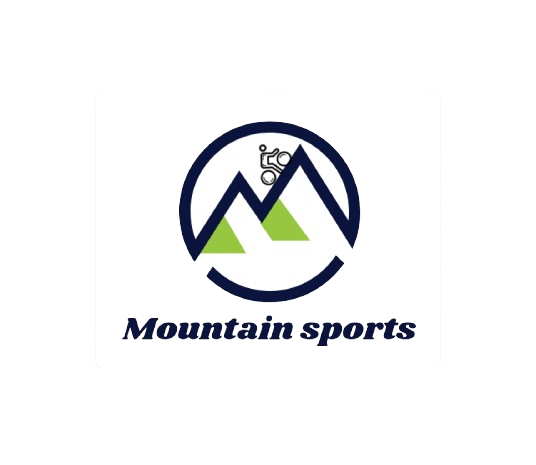
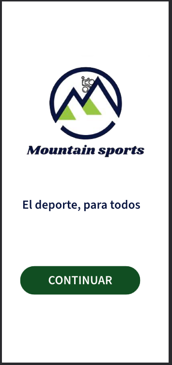
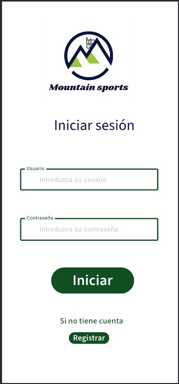
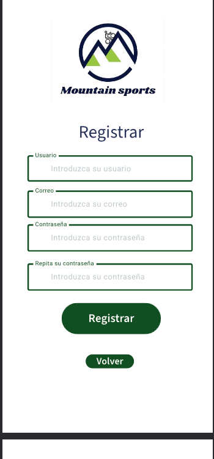
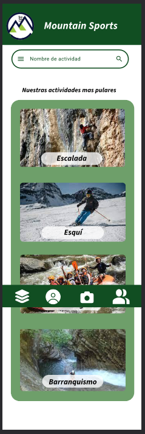
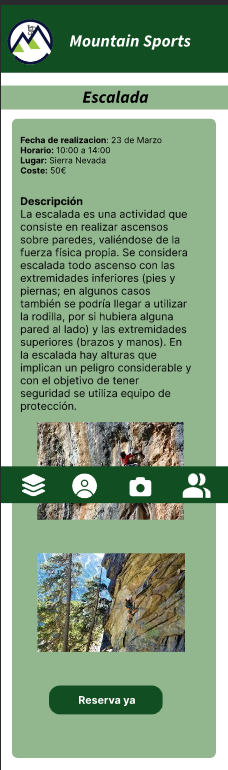
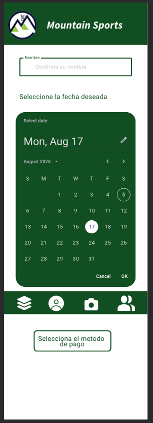
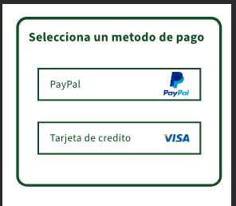

# DIU24
Prácticas Diseño Interfaces de Usuario 2023-24 (Tema: Deportes de monataña ) 

Grupo: DIU3_14avefenix.  Curso: 2023/24 

Proyecto: 
Mountain Sports

Logotipo: 

Miembros
 * :bust_in_silhouette:   Ignacio fortes soria     :octocat:     
 * :bust_in_silhouette:  Gerardo bonet perez     :octocat:

----- 

# Proceso de Diseño 

## Paso 1. UX User & Desk Research & Analisis 

 **1.a User Reseach Plan**
-----

Estamos planeando mejorar la experiencia de uso del sitio web de Granaventour. Vamos a
hablar con la gente, observar cómo usan la página y hacerles probar algunas partes para ver
qué les gusta y qué no. Queremos saber si encuentran fácil lo que buscan y si la página se
ve bien visualmente.

 1.b Competitive Analysis
-----

Granaventour enfrenta desafíos significativos. Aunque ofrece una amplia gama de
actividades, su proceso de reserva es complicado y no muestra los precios de manera clara.
Además, la organización de las actividades en su sitio web es confusa. Por el contrario,
Nevadensis y Takama Aventura son más fáciles de usar. Aunque Nevadensis también tiene
problemas con la reserva y la transparencia de precios, ofrece una amplia variedad de
actividades. Takama Aventura destaca por su facilidad de reserva y la disponibilidad de
información detallada sobre las actividades. Sin embargo, aún tiene margen de mejora en
algunos aspectos del diseño. En conclusión, Granaventour no se desempeña tan bien como
sus competidores en términos de facilidad de uso y transparencia.

 1.c Persona
-----

Hemos elegido a Paco ya que es un perfil común entre la gente que hace este tipo de
deportes, muy sociables, y con ganas de mejorar, pero que no quita que aunque no lo
exprese tenga preocupaciones.

Hemos elegido a Alicia ya que es un perfil común entre la gente joven, que estudia y trabaja
al mismo tiempo haciendo disponga de poco tiempo y presupuesto, y que además le
encanta la vida saludable y los deportes intensos.

 1.d User Journey Map
----

Paco ha sido capaz de reservar la actividad después de dos intentos, el primero por no
haber fechas disponibles no pudo ser, también se queda con ciertas dudas sobre la
información.

Alicia después de que le recomendaran la web ha sido capaz de hacer una reserva de la
actividad que ella quería pero ha tenido varias complicaciones. Una de ellas ha sido la falta
de información acerca de la actividad, como el precio, horarios o localización de la misma, y
otra de ellas ha sido la dificultad a la hora de hacer la reserva donde tenía que hacer una
pre-reserva y esperar a que la compañía se pusiese en contacto con ella.

 1.e Usability Review
----
>>>  Revisión de usabilidad: (toma los siguientes documentos de referncia y verifica puntos de verificación de  usabilidad
>>>> SE deben incluir claramente los siguientes elementos
>>> - Enlace al documento:  (sube a github el xls/pdf) 
>>> - Valoración final (numérica): 
>>> - Comentario sobre la valoración:  (60-120 caracteres)

## Paso 2. UX Design  

 2.a Reframing / IDEACION: Feedback Capture Grid / EMpathy map 
----

>>> Comenta con un diagrama los aspectos más destacados a modo de conclusion de la práctica anterior,

 Interesante | Críticas     
| ------------- | -------
  Preguntas | Nuevas ideas
  
    
>>> ¿Que planteas como "propuesta de valor" para un nuevo diseño de aplicación para economia colaborativa ?
>>> Problema e hipótesis
>>>  Que planteas como "propuesta de valor" para un nuevo diseño de aplicación para economia colaborativa te
>>> (150-200 caracteres)

 2.b ScopeCanvas
----
>>> Propuesta de valor 

 2.b User Flow (task) analysis 
-----

>>> Definir "User Map" y "Task Flow" ... 

 2.c IA: Sitemap + Labelling 
----

>>> Identificar términos para diálogo con usuario  

Término | Significado     
| ------------- | -------
  Login¿?  | acceder a plataforma

 2.d Wireframes
-----

>>> Plantear el  diseño del layout para Web/movil (organización y simulación ) 

## Paso 3. Mi UX-Case Study (diseño)

 3.a Moodboard
-----

  3.b Landing Page
----

 3.c Guidelines
----

Onboarding: Paǵina principal que ve el usuario al entrar a nuestra página

Menu(Adaptada a móvil): Menú inferior para navegar por las páginas de nuestra app móvil.

Carrusel: Carrusel que muestra varias imagenes de la actividad.

Search: Barra de búsqueda para buscar una actividad.

Card items: Para representar las actividades.

Item details: Cada actividad tiene un nombre, descripción de lo que se va a hacer en el.

Reserva: Para inscribirse a un curso.

Form Input: Formulario para logearte o registrarse

Shopping: Pasarela de pago.

Login: Para tener sesiones.

De patron extra hemos añadido: -Event Calendar para poder seleccionar que fecha queremos.

  3.d Mockup

Inicio

Login

Registro

Actividades

Actividad

Reserva

Pago

## Documentación: Publicación del Case Study
Valoración del equipo sobre la realización de esta práctica o los problemas surgidos

En resumen, hemos logrado dar forma a nuestra web y definir la estructura de navegación en la página. Sin embargo, nos encontramos con algunos desafíos al crear los diseños, ya que esta fue la parte más compleja de la práctica.

## Paso 5. Exportación & evaluación con Eye Tracking 

Exportación a HTML/Flutter
-----

)  5.b Eye Tracking method 

>>> Indica cómo diseñas experimento y reclutas usuarios (uso de gazerecorder.com)  

Diseño del experimento 
----

>> Uso de imágenes (preferentemente) -> hay que esablecer una duración de visualización y  
>> fijar las áreas de interes (AoI) antes del diseño. Planificar qué tarea debe hacer el usuario (buscar, comprar...) 

  
>> cambiar img por tu diseño de experimento  

>> Recordar que gazerecorder es una versión de pruebas: usar sólo con 3 usuarios para generar mapa de calor (recordar que crédito > 0 para que funcione) 

Resultados y valoración 
-----

>> Cambiar por tus resultados
  

## Paso 4. Evaluación 

 4.a Caso asignado
----

>>> Breve descripción del caso asignado con enlace a  su repositorio Github

 4.b User Testing
----

>>> Seleccione 4 personas ficticias. Exprese las ideas de posibles situaciones conflictivas de esa persona en las propuestas evaluadas. Asigne dos a Caso A y 2 al caso B
 

| Usuarios | Sexo/Edad     | Ocupación   |  Exp.TIC    | Personalidad | Plataforma | TestA/B
| ------------- | -------- | ----------- | ----------- | -----------  | ---------- | ----
| User1's name  | H / 18   | Estudiante  | Media       | Introvertido | Web.       | A 
| User2's name  | H / 18   | Estudiante  | Media       | Timido       | Web        | A 
| User3's name  | M / 35   | Abogado     | Baja        | Emocional    | móvil      | B 
| User4's name  | H / 18   | Estudiante  | Media       | Racional     | Web        | B 

 4.c Cuestionario SUS
----

>>> Usaremos el **Cuestionario SUS** para valorar la satisfacción de cada usuario con el diseño (A/B) realizado. Para ello usamos la [hoja de cálculo](https://github.com/mgea/DIU19/blob/master/Cuestionario%20SUS%20DIU.xlsx) para calcular resultados sigiendo las pautas para usar la escala SUS e interpretar los resultados
http://usabilitygeek.com/how-to-use-the-system-usability-scale-sus-to-evaluate-the-usability-of-your-website/)
Para más información, consultar aquí sobre la [metodología SUS](https://cui.unige.ch/isi/icle-wiki/_media/ipm:test-suschapt.pdf)

>>> Adjuntar captura de imagen con los resultados + Valoración personal 

 4.d Usability Report
----

>> Añadir report de usabilidad para práctica B (la de los compañeros)

>>> Valoración personal 

5.) Conclusion de EVALUACION (A/B testing + usability report + eye tracking) 
----

>> recupera el usability report de tu práctica (que es el caso B de los asignados a otros grupos) 
>> con los resultados del A/B testing, de eye tracking y del usability report:
>>  comentad en 2-3 parrafos cual es la conclusion acerca de la realización de la práctica y su evaluación con esas técnicas y que habéis aprendido

## Conclusión final / Valoración de las prácticas

>>> (90-150 palabras) Opinión FINAL del proceso de desarrollo de diseño siguiendo metodología UX y valoración (positiva /negativa) de los resultados obtenidos  

